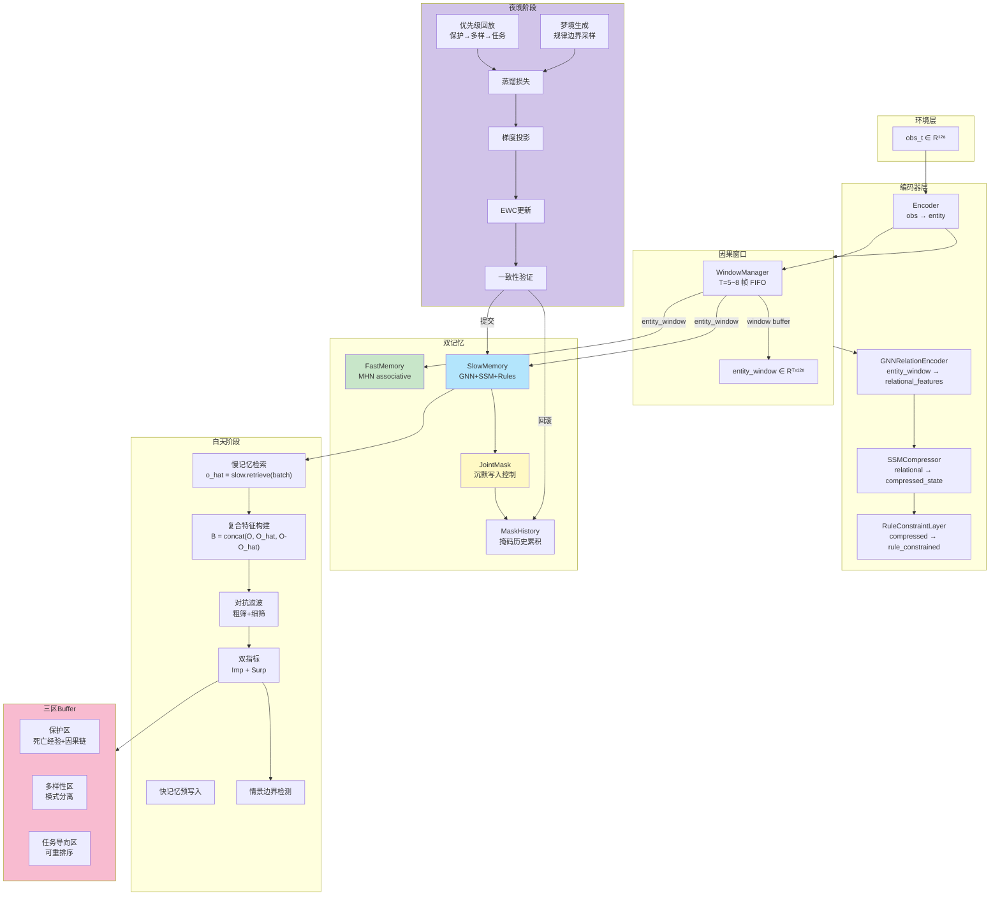

# DA-OCL: 双驱非对称在线持续学习框架

> 版本：v2.0 | 修订索引：第二版 | 状态：**项目开发规范 v1.0**

---

## 目录

1. [项目概述](#1-项目概述)
2. [设计哲学](#2-设计哲学)
3. [技术选型与依赖约束](#3-技术选型与依赖约束)
4. [项目结构](#4-项目结构)
5. [维度契约与常量定义](#5-维度契约与常量定义)
6. [核心模块详细规范](#6-核心模块详细规范)
   - [6.1 编码器层](#61-编码器层)
   - [6.2 因果窗口管理器](#62-因果窗口管理器)
   - [6.3 快记忆系统](#63-快记忆系统)
   - [6.4 慢记忆系统（三层结构）](#64-慢记忆系统三层结构)
   - [6.5 联合掩码机制](#65-联合掩码机制)
   - [6.6 复合特征构建器](#66-复合特征构建器)
   - [6.7 对抗滤波模块](#67-对抗滤波模块)
   - [6.8 指标计算模块](#68-指标计算模块)
   - [6.9 情景边界检测器](#69-情景边界检测器)
   - [6.10 Buffer 管理器（三区海马体策略）](#610-buffer-管理器三区海马体策略)
   - [6.11 白天阶段编排器](#611-白天阶段编排器)
   - [6.12 夜晚阶段编排器](#612-夜晚阶段编排器)
   - [6.13 双缓冲管理器](#613-双缓冲管理器)
   - [6.14 损失函数库](#614-损失函数库)
   - [6.15 三条调控轴](#615-三条调控轴)
7. [数据流与接口契约](#7-数据流与接口契约)
8. [训练流程编排](#8-训练流程编排)
9. [评估与验证计划](#9-评估与验证计划)
10. [开发里程碑](#10-开发里程碑)
11. [暂缓事项与触发条件](#11-暂缓事项与触发条件)
12. [代码质量规范](#12-代码质量规范)
13. [文件清单](#13-文件清单)

---

## 1. 项目概述

**DA-OCL**（Dual-Archetype Asymmetric Online Continual Learning）是一个面向高随机性环境（典型场景：Minecraft）的在线持续学习智能体框架。

**核心目标**：在开放世界的高随机性中实现稳定且可累积的持续学习，不依赖对环境外观的生成式预测，而是提取跨情境不变的因果规律。

**第一性原理**：慢记忆存储「什么关系在这个世界里始终成立」，而非「下一帧会发生什么」。

---

## 2. 设计哲学

### 2.1 认知闭环

```
白天：因果窗口感知 → 规律检索 → 认知冲突识别 → 沉默写入
夜晚：沉默痕迹激活 → 梦境边界审视 → 梯度防护更新
反馈：梦境发现的盲区驱动白天主动探索规律最稀疏的情境
```

### 2.2 双记忆不对等关系

| 维度 | 快记忆 | 慢记忆 |
|------|--------|--------|
| 目标 | 高容量联想工作台 | 因果结构编码器 |
| 容量 | 超线性（MHN） | 受限（规律稀疏性约束） |
| 更新频率 | 每步 | 夜晚整合 |
| 生命周期 | 短期 | 永久（EWC防护） |
| 知识来源 | 当前经验 | 快记忆蒸馏 + 沉默激活 |

### 2.3 联合掩码的生物学隐喻

参照 MIT 2017（Kitamura et al., Science）：记忆同时形成于海马体（快）和新皮层（慢），慢记忆的写入以「沉默痕迹」形式存在——突触连接存在但权重极弱。白天慢记忆的写入受联合掩码控制，夜晚通过激活强化使痕迹成熟。

---

## 3. 技术选型与依赖约束

### 3.1 强制依赖（所有模块共用）

```
torch >= 2.2.0          # PyTorch 主框架
numpy >= 1.24.0         # 数值计算
omegaconf >= 2.3.0      # YAML 配置管理
tqdm >= 4.65.0           # 进度条
```

### 3.2 慢记忆 SSM 层（Mamba）

```
mamba-ssm >= 2.0.0       # 状态空间模型，用于规律压缩层
# 注意：若 mamba-ssm 安装失败，启用降级方案：使用自定义 SSM 实现
```

**降级策略**：在 `da_ocl/layers/ssm.py` 中提供 `SSMLayer` 的 PyTorch 纯实现，不依赖 mamba-ssm 包。

### 3.3 可选依赖（不影响核心流程）

```
scipy >= 1.10.0          # 科学计算（情景边界检测的统计计算）
matplotlib >= 3.7.0     # 可视化（训练曲线、Buffer 分布）
wandb >= 0.15.0          # 实验追踪（可选，非必须）
tensorboard >= 2.13.0    # 替代的实验追踪
```

### 3.4 最低运行环境

- Python >= 3.10
- CUDA >= 11.7（如使用 GPU）
- RAM >= 16GB（CPU 模式），VRAM >= 8GB（GPU 模式）

---

## 4. 项目结构

```
e:/DA/
├── PROJECT.md                        # 本文档（项目根目录）
├── SPEC.md                           # 详细技术规范（模块接口、数据格式）
├── README.md                         # 项目说明
├── pyproject.toml                    # Python 包管理配置
├── requirements.txt                  # pip 依赖
├── requirements-dev.txt              # 开发依赖（测试、lint）
├── .gitignore
│
├── da_ocl/                           # 主包
│   ├── __init__.py
│   ├── config.py                     # 配置类：所有超参数的单一来源
│   │                                 # （由 config.yaml 生成，不允许硬编码）
│   │
│   ├── core/                         # 核心模块（白天+夜晚共享）
│   │   ├── __init__.py
│   │   ├── constants.py              # 维度契约、符号常量（obs_dim, ssm_state_dim 等）
│   │   ├── encoder.py                # 编码器层（obs_dim → entity_dim）
│   │   ├── gnn_layer.py              # GNN 实体关系编码层
│   │   ├── ssm_layer.py              # SSM 规律压缩层（含降级实现）
│   │   ├── rule_constraints.py       # 逻辑约束层（注意力机制）
│   │   └── composite_builder.py       # 复合特征构建器（B = concat(O, O_hat, O-O_hat)）
│   │
│   ├── memory/                       # 双记忆系统
│   │   ├── __init__.py
│   │   ├── fast_memory.py            # 快记忆（MHN 实现）
│   │   ├── fast_memory_ops.py        # MHN 核心操作（联想检索、写入）
│   │   ├── slow_memory.py            # 慢记忆（三层结构容器）
│   │   ├── joint_mask.py             # 联合掩码计算（白天写入控制）
│   │   └── mask_history.py            # 掩码历史累积管理器
│   │
│   ├── causal/                       # 因果窗口管理
│   │   ├── __init__.py
│   │   ├── window_manager.py         # 因果窗口管理器（5~8 帧）
│   │   ├── surprise_detector.py       # 惊喜度计算（窗口级别）
│   │   ├── boundary_detector.py       # 情景边界检测器
│   │   └── coverage_tracker.py        # 规律覆盖追踪器
│   │
│   ├── buffer/                       # Buffer 管理
│   │   ├── __init__.py
│   │   ├── three_zone_buffer.py      # 三区 Buffer 容器
│   │   ├── protected_zone.py         # 保护区（死亡经验 + 因果链追溯）
│   │   ├── diversity_zone.py        # 规律多样性区（模式分离）
│   │   ├── task_zone.py             # 任务导向区（可重排序）
│   │   └── replacement_strategy.py   # 替换策略执行器
│   │
│   ├── day/                          # 白天阶段
│   │   ├── __init__.py
│   │   ├── phase_controller.py       # 白天阶段总控制器
│   │   ├── retrieval.py              # 规律检索路径（慢记忆检索）
│   │   ├── pre_write.py             # 快记忆预写入准备
│   │   ├── adversarial_filter.py     # 对抗滤波（两级）
│   │   ├── metrics.py               # Imp/Surp 双指标计算
│   │   └── day_pipeline.py           # 白天并行+串行编排
│   │
│   ├── night/                        # 夜晚阶段
│   │   ├── __init__.py
│   │   ├── phase_controller.py       # 夜晚阶段总控制器
│   │   ├── distillation.py           # 蒸馏损失计算
│   │   ├── dream_generator.py       # 梦境生成（规律覆盖边界采样）
│   │   ├── gradient_projector.py     # 梯度投影
│   │   ├── ewc_updater.py            # EWC 更新
│   │   ├── consistency_gate.py       # 一致性验证门控
│   │   ├── night_trigger.py          # 夜晚触发条件判断
│   │   └── night_pipeline.py         # 夜晚并行+串行编排
│   │
│   ├── buffer/                       # 双缓冲（白+夜并发安全）
│   │   ├── double_buffer.py
│   │   └── buffer_switch.py
│   │
│   ├── losses/                       # 损失函数库
│   │   ├── __init__.py
│   │   ├── distillation_loss.py       # L_distill
│   │   ├── kl_loss.py               # L_KL（beta 加权）
│   │   ├── ewc_loss.py              # L_EWC
│   │   ├── dream_loss.py            # L_dream
│   │   └── total_night_loss.py      # L_night 合并计算
│   │
│   ├── regulation/                   # 三条调控轴
│   │   ├── __init__.py
│   │   ├── importance.py             # Importance 调控轴
│   │   ├── surprise.py               # Surprise 调控轴
│   │   └── temporal_decay.py         # Delta_t 时间衰减轴
│   │
│   ├── agent.py                      # 智能体主类（对外唯一接口）
│   ├── trainer.py                    # 训练器（白天+夜晚流程编排）
│   └── utils.py                      # 通用工具（设备管理、seed、checkpoint）
│
├── envs/                             # 环境接口层（适配 Minecraft 类环境）
│   ├── __init__.py
│   ├── base_env.py                   # 环境基类（定义接口契约）
│   └── dummy_env.py                  # 测试用 dummy 环境
│
├── experiments/                      # 实验配置与运行脚本
│   ├── configs/
│   │   ├── config.yaml               # 默认配置
│   │   ├── debug.yaml                # 调试配置（小规模）
│   │   └── minecraft.yaml            # Minecraft 环境配置
│   └── run_experiment.py             # 实验入口脚本
│
├── tests/                            # 测试套件
│   ├── __init__.py
│   ├── conftest.py                   # pytest fixtures
│   ├── test_encoder.py
│   ├── test_memory.py
│   ├── test_causal.py
│   ├── test_buffer.py
│   ├── test_day_phase.py
│   ├── test_night_phase.py
│   ├── test_losses.py
│   └── test_integration.py           # 端到端集成测试
│
└── docs/                             # 文档
    ├── architecture.md               # 架构图与模块关系
    └── data_flow.md                  # 数据流图
```

---

## 5. 维度契约与常量定义

所有维度常量**必须**从 `da_ocl/core/constants.py` 导入，禁止在业务代码中硬编码数字。

```python
# da_ocl/core/constants.py
"""
DA-OCL v2 维度契约
所有模块共享的唯一真实来源（Single Source of Truth）
"""

# === 维度参数 ===
OBS_DIM: int = 128          # 单帧原始环境观测维度
ENTITY_DIM: int = 128        # 实体嵌入维度（编码器输出）
GNN_HIDDEN_DIM: int = 256    # GNN 中间层维度
SSM_STATE_DIM: int = 512     # SSM 隐状态维度（全局唯一基准）
RULE_DIM: int = 256          # 元规则向量维度
ACTION_DIM: int = 32         # 动作向量维度
COMPOSITE_DIM: int = 3 * SSM_STATE_DIM  # 复合特征 B 的维度 = 1536

# === 因果窗口参数 ===
WINDOW_SIZE_MIN: int = 5     # 因果窗口最小长度
WINDOW_SIZE_MAX: int = 8     # 因果窗口最大长度
WINDOW_SIZE_DEFAULT: int = 6 # 默认因果窗口长度

# === Buffer 区域容量比例 ===
BUFFER_ZONE_RATIOS_INITIAL = {
    "protected": 0.10,   # 保护区
    "diversity": 0.40,  # 规律多样性区
    "task": 0.50,        # 任务导向区
}
BUFFER_ZONE_RATIOS_MATURE = {
    "protected": 0.10,   # 保护区（固定）
    "diversity": 0.20,   # 规律多样性区（萎缩）
    "task": 0.70,       # 任务导向区（扩张）
}

# === 调控轴参数默认值 ===
SURPRISE_SIGMA: float = 1.0      # 惊喜度归一化系数
LAMBDA_DECAY: float = 0.01       # Delta_t 衰减系数
ALPHA_IMPORTANCE: float = 0.7    # Importance 中 (1-Coverage) 的权重
BETA0_KL: float = 1.0            # KL 损失基准系数
ALPHA_KL: float = 0.5            # KL 中 Imp 的衰减系数
GAMMA_DREAM: float = 0.1         # 梦境损失权重系数
EWC_LAMBDA: float = 5000.0       # EWC 正则化强度

# === 情景边界检测参数 ===
BOUNDARY_N_SIGMA: float = 2.0    # 边界触发倍数（mu + N*sigma）
BOUNDARY_HISTORY_SIZE: int = 50  # 计算历史均值/方差的历史窗口大小

# === 夜晚触发条件 ===
NIGHT_WINDOW_THRESHOLD: int = 500    # Buffer 窗口数量阈值
NIGHT_MASK_DENSITY_THRESHOLD: float = 0.3  # 掩码激活密度阈值
NIGHT_SURP_THRESHOLD: float = 2.0    # 滑动窗口平均 Surp 阈值
NIGHT_TIMESTEP_FALLBACK: int = 5000  # 时间步数兜底触发

# === 死亡经验参数 ===
DEATH_R_PENALTY_THRESHOLD: float = 8.0   # 触发保护区的 r_penalty 绝对阈值
DEATH_CAUSAL_CHAIN_T: int = 8           # 死亡前因果链追溯帧数
DEATH_PRIORITY_GAMMA: float = 0.9        # 死亡追溯优先级衰减系数
```

---

## 6. 核心模块详细规范

### 6.1 编码器层

**文件**：`da_ocl/core/encoder.py`

**职责**：将单帧原始观测 `obs ∈ R^{obs_dim}` 编码为实体特征向量 `entity ∈ R^{entity_dim}`。

**架构**：
```python
Encoder(nn.Module):
    obs_dim -> Linear(128->256) -> ReLU() -> Dropout(0.1) -> Linear(256->128) -> entity
```

**约束**：
- 输出维度必须是 `ENTITY_DIM`，不可更改
- 必须输出可微连续表征（供 GNN 使用）
- 测试：输入随机 obs，输出 shape 必须为 `(batch, ENTITY_DIM)`

---

### 6.2 因果窗口管理器

**文件**：`da_ocl/causal/window_manager.py`

**职责**：
1. 接收连续帧的编码后实体特征
2. 维护固定长度的 FIFO 窗口（长度 5~8，可配置）
3. 输出 `EntityWindow = List[entity]`，长度为 T（因果窗口长度）
4. 通知 BoundaryDetector 当前 batch 是否已触发新情景

**关键接口**：
```python
class CausalWindowManager:
    def __init__(self, window_size: int = WINDOW_SIZE_DEFAULT): ...
    
    def push(self, entity: Tensor) -> EntityWindow:
        """推送一帧到窗口，返回当前完整窗口（固定长度 T）"""
        
    def get_batch(self) -> Tensor:
        """返回 (T, entity_dim) 形状的窗口张量"""
        
    def reset(self): ...
```

---

### 6.3 快记忆系统

**文件**：`da_ocl/memory/fast_memory.py`

**实现**：基于现代霍普菲尔德网络（MHN），参考 Hopfield 网络的连续更新规则。

**存储内容**：因果窗口的联合表征，而非单帧表征。写入内容为 `CompositeWindow`（复合特征的时间序列）。

**核心操作**：

```python
class FastMemory(nn.Module):
    """快记忆：现代霍普菲尔德网络实现"""
    
    def store(self, composite_features: List[Tensor]):
        """存储一个因果窗口的复合特征序列（窗口级别表征）"""
        
    def retrieve(self, query: Tensor) -> Tuple[Tensor, Tensor]:
        """联想检索，返回 (best_match, attention_weights)"""
        # query: 当前窗口复合特征 B ∈ R^{COMPOSITE_DIM}
        # 返回：最相似的存储表征 + 注意力权重
        
    def capacity(self) -> int:
        """返回当前存储的窗口数量"""
```

**容量**：超线性存储容量（MHN 理论保证），初始容量 > 1000 个窗口表征。

---

### 6.4 慢记忆系统（三层结构）

**文件**：`da_ocl/memory/slow_memory.py`

慢记忆是三层级联结构，由 `SlowMemory` 容器类统一管理：

```python
class SlowMemory(nn.Module):
    """慢记忆三层结构容器"""
    
    def __init__(self, use_mamba: bool = True):
        self.gnn = GNNRelationEncoder()      # 实体-关系层
        self.ssm = SSMCompressor(use_mamba)  # 规律压缩层
        self.rules = RuleConstraintLayer()    # 逻辑约束层
    
    def forward(self, entity_window: Tensor) -> Tuple[Tensor, Tensor, Tensor]:
        """
        输入: entity_window ∈ R^{T x entity_dim}
        输出:
          - gnn_out: T x GNN_HIDDEN_DIM  （GNN 跨帧实体关系）
          - ssm_out: SSM_STATE_DIM        （规律压缩表征）
          - rule_out: RULE_DIM            （元规则软约束输出）
        """
        
    def load_state_dict_from_buffer(self, state_dict: Dict): ...
    
    def get_state_dict(self) -> Dict: ...
```

#### 6.4.1 GNN 实体关系编码层

**文件**：`da_ocl/core/gnn_layer.py`

**架构**：简化的图注意力网络（GAT-lite），处理实体节点之间的动态关系。

```python
class GNNRelationEncoder(nn.Module):
    """GNN 实体关系编码层"""
    
    # 输入: entity_window ∈ R^{T x entity_dim}
    # 假设窗口内有 N 个实体节点，构建全连接图
    # 输出: relational_features ∈ R^{T x GNN_HIDDEN_DIM}
    
    def forward(self, entity_window: Tensor, num_entities: int = 4) -> Tensor:
        """
        Args:
            entity_window: (T, entity_dim) 窗口内实体的嵌入序列
            num_entities: 窗口内实体数量（默认 4，支持动态）
        Returns:
            (T, GNN_HIDDEN_DIM) 跨帧实体关系表征
        """
```

**关键**：跨帧建模——GNN 的每帧输出需要携带时序上下文（通过将 T 维度作为 batch 维度处理，建模跨帧关系变化）。

#### 6.4.2 SSM 规律压缩层

**文件**：`da_ocl/core/ssm_layer.py`

**职责**：在 GNN 输出的时序维度压缩，提取跨帧时序不变的物理规律表征。

```python
class SSMCompressor(nn.Module):
    """
    SSM 规律压缩层
    
    输入: relational_features ∈ R^{T x GNN_HIDDEN_DIM}
    输出: compressed_state ∈ R^{SSM_STATE_DIM}
    
    压缩方式: 时间维度压缩（所有 T 帧 → 1 个状态向量）
    
    优先使用 Mamba-SSM。若不可用，使用自定义 PyTorch 实现。
    """
    
    def __init__(self, use_mamba: bool = True):
        self.use_mamba = use_mamba
        if use_mamba:
            try:
                from mamba_ssm import Mamba
                self.ssm = Mamba(d_model=GNN_HIDDEN_DIM, d_state=SSM_STATE_DIM)
            except ImportError:
                warnings.warn("mamba-ssm 不可用，使用降级 SSM 实现")
                self.use_mamba = False
                self.ssm = FallbackSSMLayer(GNN_HIDDEN_DIM, SSM_STATE_DIM)
        else:
            self.ssm = FallbackSSMLayer(GNN_HIDDEN_DIM, SSM_STATE_DIM)
    
    def forward(self, x: Tensor) -> Tensor:
        # x: (T, GNN_HIDDEN_DIM)
        # 输出: (SSM_STATE_DIM,)
        ...
```

**降级实现**（`FallbackSSMLayer`）：

```python
class FallbackSSMLayer(nn.Module):
    """纯 PyTorch SSM 降级实现（不依赖 mamba-ssm）"""
    
    def __init__(self, input_dim: int, state_dim: int):
        super().__init__()
        # 使用双向 GRU 压缩时序
        self.gru = nn.GRU(input_dim, state_dim, batch_first=True, bidirectional=True)
        self.proj = nn.Linear(state_dim * 2, state_dim)
        self.norm = nn.LayerNorm(state_dim)
    
    def forward(self, x: Tensor) -> Tensor:
        # x: (T, input_dim)
        # 使用所有时间步的隐状态均值
        outputs, _ = self.gru(x.unsqueeze(0))  # (1, T, hidden*2)
        mean_h = outputs.squeeze(0).mean(dim=0)  # (hidden*2,)
        return self.norm(self.proj(mean_h))     # (state_dim,)
```

#### 6.4.3 逻辑约束层

**文件**：`da_ocl/core/rule_constraints.py`

**架构**：多头注意力机制，在 SSM 输出的时序压缩表征上施加元规则软约束。

```python
class RuleConstraintLayer(nn.Module):
    """
    逻辑约束层：多头注意力机制
    
    输入:
      - query: SSM 输出表征 h_t ∈ R^{SSM_STATE_DIM}
      - key/value: 元规则库 R ∈ R^{num_rules x RULE_DIM}
    
    输出: z_slow ∈ R^{RULE_DIM}，约束后的慢记忆表征
    """
    
    def __init__(self, num_rules: int = 32, num_heads: int = 4):
        super().__init__()
        self.multihead_attn = nn.MultiheadAttention(
            embed_dim=SSM_STATE_DIM,
            num_heads=num_heads,
            kdim=RULE_DIM,
            vdim=RULE_DIM,
            batch_first=True,
        )
        self.rule_library = nn.Parameter(
            torch.randn(32, RULE_DIM)  # 可学习的元规则库
        )
        self.norm = nn.LayerNorm(SSM_STATE_DIM)
        self.proj = nn.Linear(SSM_STATE_DIM, RULE_DIM)
    
    def forward(self, ssm_output: Tensor) -> Tensor:
        # ssm_output: (SSM_STATE_DIM,) → reshape to (1, SSM_STATE_DIM)
        # 使用元规则库作为 K/V
        query = ssm_output.unsqueeze(0)  # (1, SSM_STATE_DIM)
        attn_out, _ = self.multihead_attn(query, self.rule_library, self.rule_library)
        # ...残差连接 + 投影
        return z_slow
```

---

### 6.5 联合掩码机制

**文件**：`da_ocl/memory/joint_mask.py`

**核心公式**：

```
mask_batch = max_t(sigmoid(Surp_t)) × (1 - CoverageRate_batch)
```

**约束**：
- `mask` 的 shape 必须与慢记忆参数的 shape 完全一致（参数级掩码）
- 掩码值范围：`[0, 1]`（标量，广播到参数张量）
- 取 `max` 而非 `mean` 的语义：窗口内只要有一帧足够显著，整个窗口的写入强度都提升

```python
def compute_joint_mask(
    surprise_per_frame: Tensor,      # shape: (T,) 每帧的惊喜度
    coverage_rate: float,              # 当前窗口的规律覆盖缺口 ∈ [0,1]
    slow_params_shape: Dict,          # 慢记忆参数形状，用于生成正确 shape 的掩码
) -> Tensor:
    """
    计算联合掩码
    
    Args:
        surprise_per_frame: (T,) 每帧惊喜度
        coverage_rate: 当前窗口的规律覆盖缺口 (1 - CoverageRate_batch)
        slow_params_shape: 慢记忆参数形状字典
    
    Returns:
        mask: 与慢记忆参数同 shape 的张量，值为标量掩码
              所有参数共享同一个掩码标量值
    """
    peak_conflict = torch.sigmoid(surprise_per_frame).max()  # max_t(sigmoid(Surp_t))
    mask_value = peak_conflict * coverage_rate
    return mask_value  # 标量，广播
```

---

### 6.6 复合特征构建器

**文件**：`da_ocl/core/composite_builder.py`

**公式**：

```
B = concat(O_batch, O_hat_batch, O_batch - O_hat_batch)
B ∈ R^{3 × SSM_STATE_DIM}
```

**关键语义**：
- `O_batch`：当前窗口的实际慢记忆输出（SSM_STATE_DIM）
- `O_hat_batch`：检索到的规律激活向量（SSM_STATE_DIM）
- `O - O_hat`：残差，定位「哪些时刻、哪些实体关系违反了已知规律」

```python
class CompositeFeatureBuilder:
    @staticmethod
    def build(
        o_batch: Tensor,      # (SSM_STATE_DIM,) 当前窗口实际表征
        o_hat_batch: Tensor,  # (SSM_STATE_DIM,) 检索到的规律表征
    ) -> Tensor:
        """构建因果窗口级别的复合特征 B"""
        residual = o_batch - o_hat_batch
        composite = torch.cat([o_batch, o_hat_batch, residual], dim=-1)
        assert composite.shape[-1] == COMPOSITE_DIM  # = 3 * 512 = 1536
        return composite  # shape: (COMPOSITE_DIM,)
```

---

### 6.7 对抗滤波模块

**文件**：`da_ocl/day/adversarial_filter.py`

**两级滤波**：

| 阶段 | 输入 | 逻辑 | 阈值 |
|------|------|------|------|
| 第一级（粗筛） | batch 整体统计量 | 超过阈值则整 batch 放弃 | `filter_coarse_thresh = 0.5` |
| 第二级（细筛） | 逐帧分析（仅当粗筛通过且过滤比 ≤ 50%） | 放弃高冲突帧，保留其余 | `filter_fine_thresh = 0.7` |

**决策逻辑**：
- 若粗筛的过滤比超过 50%，跳过细筛，保留整个 batch
- 若粗筛的过滤比 ≤ 50%，进入细筛
- 细筛后如果有效帧数 < 2，放弃整个 batch

---

### 6.8 指标计算模块

**文件**：`da_ocl/day/metrics.py`

**Imp_batch（重要性）**：

```python
def compute_importance(
    coverage_rate: float,
    r_penalty: float,
    alpha: float = ALPHA_IMPORTANCE,
) -> float:
    """
    Imp_t = alpha * (1 - CoverageRate) + (1 - alpha) * r_penalty
    
    注意：r_penalty 独立设有绝对阈值（DEATH_R_PENALTY_THRESHOLD），
    超过阈值的经验直接进入保护区，不参与此计算。
    """
    return alpha * (1 - coverage_rate) + (1 - alpha) * r_penalty
```

**Surp_batch（惊喜度）**：

```python
def compute_surprise(
    o_batch: Tensor,     # (SSM_STATE_DIM,) 当前窗口慢记忆表征
    o_hat_batch: Tensor, # (SSM_STATE_DIM,) 检索到的规律表征
) -> Tuple[float, Tensor]:
    """
    Surp_t = ||O_batch - O_hat_batch||_2
    
    返回:
      - scalar: 窗口级别的惊喜度标量
      - per_frame: (T,) 每帧的惊喜度（用于联合掩码的 max 计算）
    """
    diff = o_batch - o_hat_batch
    scalar = torch.norm(diff, p=2).item()
    # per_frame: 通过反向投影估算每帧贡献（简化实现）
    per_frame = torch.full((T,), scalar / T)
    return scalar, per_frame
```

---

### 6.9 情景边界检测器

**文件**：`da_ocl/causal/boundary_detector.py`

**触发条件**：

```
触发边界 ⇔ mean(Surp_batch) > mu_history + N * sigma_history
```

**约束**：
- 在 batch 粒度上检测（比单帧更稳定，减少噪声假阳性）
- 情景块是 Buffer 存储和替换的**基本单位**，不可拆分
- 边界触发时，通知 BufferManager 当前窗口是一个新的情景块

```python
class BoundaryDetector:
    def __init__(self, n_sigma: float = BOUNDARY_N_SIGMA, history_size: int = BOUNDARY_HISTORY_SIZE):
        self.history: List[float] = []  # 历史 batch 惊喜度
        self.n_sigma = n_sigma
        self.history_size = history_size
    
    def detect(self, batch_surprise: float) -> bool:
        """返回是否触发新情景边界"""
        self.history.append(batch_surprise)
        if len(self.history) > self.history_size:
            self.history.pop(0)
        
        if len(self.history) < 10:  # 预热期不触发
            return False
        
        mu = np.mean(self.history)
        sigma = np.std(self.history)
        return batch_surprise > mu + self.n_sigma * sigma
    
    def reset(self): ...
```

---

### 6.10 Buffer 管理器（三区海马体策略）

**文件**：`da_ocl/buffer/three_zone_buffer.py`

#### 6.10.1 总体结构

```python
class ThreeZoneBuffer:
    """
    三区海马体启发 Buffer
    
    各区独立管理，通过 capacity_allocator 动态调整容量分配。
    替换逻辑各区独立，不跨区竞争。
    """
    
    def __init__(self, total_capacity: int = 10000):
        self.protected = ProtectedZone(capacity=int(total_capacity * 0.10))
        self.diversity = DiversityZone(capacity=int(total_capacity * 0.40))
        self.task = TaskOrientedZone(capacity=int(total_capacity * 0.50))
        self._capacity_allocator = CapacityAllocator(total_capacity)
    
    def add(self, experience: Experience, zone_hint: Optional[str] = None) -> bool:
        """
        尝试添加一条经验到对应区域。
        返回是否成功写入。
        """
        
    def sample(self, num: int, priority: str = "diversity") -> List[Experience]:
        """
        按优先级采样经验用于夜晚蒸馏回放。
        优先级顺序：protected > diversity > task
        """
        
    def rebalance(self, coverage_mean: float):
        """
        根据 CoverageRate 全局均值调整各区容量。
        
        规律库越空（均值低）→ 多样性区占比越大
        规律库趋于饱和（均值高）→ 任务导向区占比越大
        """
```

#### 6.10.2 保护区

**文件**：`da_ocl/buffer/protected_zone.py`

**行为**：
- 死亡经验（`r_penalty > DEATH_R_PENALTY_THRESHOLD`）直接进入保护区
- **因果链追溯**：死亡经验**不只保存死亡帧**，向前追溯整个导致死亡的情景块

```python
@dataclass
class Experience:
    """Buffer 中存储的最小单位"""
    window: Tensor              # (T, entity_dim) 因果窗口
    composite: Tensor           # (COMPOSITE_DIM,) 复合特征
    surprise: float             # batch 惊喜度
    importance: float           # batch 重要性
    coverage_rate: float        # 窗口规律覆盖情况
    r_penalty: float            # 奖励惩罚值（仅死亡相关经验 > 阈值）
    is_death: bool              # 是否为死亡经验
    causal_chain: Optional[List[int]] = None  # 因果链追溯的帧索引
    
    # === 元数据 ===
    timestep: int               # 记录时的全局时间步
    priority_score: float       # 综合优先级分数
    pattern_overlap: float      # 与规律库的重叠度（多样性区使用）
    task_value: float           # 任务价值分数（任务导向区使用）


class ProtectedZone:
    """
    保护区：不参与竞争替换的固定区域
    
    替换条件（严格）：
    - 区域已满 AND 新死亡经验的 r_penalty 更高
    - 替换区内 priority_score 最低的经验
    """
    
    def add_death_experience(
        self,
        experience: Experience,
        causal_chain: List[Experience],  # 死亡前追溯的完整情景块
    ):
        """
        死亡经验的因果链追溯：
        - 死亡帧直接进入保护区
        - 向前追溯 DEATH_CAUSAL_CHAIN_T 帧，优先级随距离衰减
        - gamma^(T_death - k) 衰减：越接近死亡的帧优先级越高
        """
        
        # 死亡帧
        experiences_with_priority = [experience]
        
        # 追溯帧（优先级衰减）
        for k, past_exp in enumerate(reversed(causal_chain)):
            decay = DEATH_PRIORITY_GAMMA ** (k + 1)
            past_exp.priority_score = experience.r_penalty * decay
            experiences_with_priority.append(past_exp)
        
        for exp in experiences_with_priority:
            self._try_add(exp)
```

#### 6.10.3 规律多样性区

**文件**：`da_ocl/buffer/diversity_zone.py`

**行为**：保证规律库所有稀疏区域始终有训练信号。

```python
class DiversityZone:
    """
    规律多样性区：模式分离保护
    
    替换策略：
    - 新窗口进入时，计算其规律覆盖与区内已有经验的 overlap
    - overlap 高 → 丢弃（该规律域已有充分代表）
    - overlap 低 → 替换区内 overlap 最高的经验
    """
    
    def compute_overlap(self, new_exp: Experience, existing_exp: Experience) -> float:
        """
        计算两条经验的规律重叠度（余弦相似度）
        使用 composite 特征的余弦相似度作为代理
        """
        cos_sim = F.cosine_similarity(
            new_exp.composite,
            existing_exp.composite,
            dim=-1,
        )
        return cos_sim.item()
```

#### 6.10.4 任务导向区

**文件**：`da_ocl/buffer/task_zone.py`

**行为**：支持对已有经验的重要性分数重新评估。

```python
class TaskOrientedZone:
    """
    任务导向区：目标导向显著性
    
    - 按 task_value 分数排序
    - 新经验进入时替换区内 task_value 最低的经验
    - 区内经验支持重新评分（同一个经验在不同任务目标下分数可以差很多）
    """
    
    def re_evaluate_all(self, new_task_weights: Dict[str, float]):
        """
        根据新的任务目标权重重新评估所有经验的任务价值。
        重新排序后，被低分经验占据的容量可以被新经验替换。
        """
        for exp in self.experiences:
            exp.task_value = self._compute_task_value(exp, new_task_weights)
        self.experiences.sort(key=lambda e: e.task_value, reverse=True)
```

---

### 6.11 白天阶段编排器

**文件**：`da_ocl/day/day_pipeline.py`

**并行+串行混合编排**：

```
因果窗口到达
    │
    ├─ 路径A（慢记忆检索）─────────┐
    │  slow_memory.retrieve(batch)  → o_hat_batch
    │                               ↓
    │                               汇合点：等待路径A
    │
    ├─ 路径A_同步（联合掩码+沉默写入）─┐
    │  joint_mask.compute() + slow_memory.silent_write()
    │  （完全并行，不依赖检索结果）
    │
    ├─ 路径B（快记忆预写入准备）─────────┐
    │  fast_memory.prepare_write(batch)
    │  composite_features 预计算
    │                               ↓
    ├─ 汇合点：复合特征构建
    │  B = concat(O_batch, O_hat_batch, O-O_hat_batch)
    │                               ↓
    ├─ 对抗滤波（两级）
    │  ├─ 第一级：batch 整体粗筛
    │  └─ 第二级：逐帧细筛（过滤比 ≤ 50% 时）
    │                               ↓
    ├─ 双指标计算（并行）
    │  ├─ Imp_batch = alpha*(1-CoverageRate) + (1-alpha)*r_penalty
    │  └─ Surp_batch = ||O - O_hat||_2
    │                               ↓
    ├─ 情景边界检测
    │  mean(Surp_batch) > mu + N*sigma → 新情景开始
    │                               ↓
    └─ 掩码历史累积
       mask_history.accumulate(peak_mask)  # 逐参数累积 max
```

---

### 6.12 夜晚阶段编排器

**文件**：`da_ocl/night/night_pipeline.py`

**并行+串行混合编排**：

```
夜晚触发
    │
    ├─ 路径1（优先级回放）
    │  Buffer.sample(priority="protected_first")
    │  → 计算 L_distill = Σ_t Surp_t * ||f_slow - f_fast||²
    │                               ↓
    │                               汇合点
    │
    ├─ 路径2（梦境生成）
    │  DreamGenerator.sample_at_coverage_boundary()
    │  → 计算 L_dream
    │                               ↓
    │                               汇合点
    │
    ├─ 损失合并
    │  L_night = L_distill + beta*Σ*alpha*...*L_KL + L_EWC + gamma*L_dream
    │                               ↓
    ├─ 梯度投影
    │  gradient_projector.project(gradients, mask_history)
    │  → 只对有沉默写入记录的参数计算梯度
    │                               ↓
    ├─ EWC 更新
    │  ewc_updater.compute_penalty(grad_params, fisher_info)
    │                               ↓
    ├─ 一致性验证门控
    │  consistency_gate.validate() → 通过则提交，回滚则保留掩码历史
    │                               ↓
    └─ 双缓冲原子替换
       buffer_A ← buffer_B（原子操作）
       掩码历史清零（仅在验证通过后）
```

---

### 6.13 双缓冲管理器

**文件**：`da_ocl/buffer/double_buffer.py`

**问题**：夜晚整合期间慢记忆参数在变动，白天检索需要稳定的参数版本。

```python
class DoubleBufferManager:
    """
    双缓冲：解决白天检索和夜晚更新并发问题
    
    - Buffer A: 当前服务白天检索的稳定版本
    - Buffer B: 夜晚正在被激活更新的版本
    
    切换策略：原子替换（整合完成且验证通过后）
    内存代价：慢记忆参数量 × 2
    """
    
    def __init__(self, slow_memory: SlowMemory):
        self.buffer_A = copy.deepcopy(slow_memory.state_dict())
        self.buffer_B = None
    
    def get_active(self) -> Dict:
        """返回当前服务白天的稳定版本"""
        return self.buffer_A
    
    def start_night_update(self) -> Dict:
        """开始夜晚更新：复制 A 到 B"""
        self.buffer_B = copy.deepcopy(self.buffer_A)
        return self.buffer_B
    
    def commit_night_update(self):
        """夜晚更新完成：原子替换 A ← B"""
        assert self.buffer_B is not None, "未开始夜晚更新"
        self.buffer_A = self.buffer_B
        self.buffer_B = None
    
    def rollback_night_update(self):
        """夜晚更新回滚：丢弃 B"""
        self.buffer_B = None
        # 掩码历史保留，下次整合继续累积
    
    def get_night_working_copy(self) -> SlowMemory:
        """返回夜晚更新的工作副本（SlowMemory 对象）"""
        ...
```

---

### 6.14 损失函数库

**文件**：`da_ocl/losses/`

#### 6.14.1 L_distill（蒸馏损失）

```python
# da_ocl/losses/distillation_loss.py
def compute_distillation_loss(
    slow_outputs: List[Tensor],
    fast_outputs: List[Tensor],
    surprise_per_frame: List[Tensor],
) -> Tensor:
    """
    L_distill = Σ_t Surp_t * ||f_slow(B_t) - f_fast(B_t)||²
    
    注意：这里的 f_slow 和 f_fast 是对同一个复合特征 B_t 的输出比较。
    快记忆和慢记忆对同一经验应当有一致性表征。
    """
    total_loss = 0.0
    for t in range(len(slow_outputs)):
        diff_sq = torch.sum((slow_outputs[t] - fast_outputs[t]) ** 2)
        total_loss += surprise_per_frame[t] * diff_sq
    return total_loss
```

#### 6.14.2 L_KL（beta 加权 KL 散度）

```python
# da_ocl/losses/kl_loss.py
def compute_beta(
    importance: float,
    surprise: float,
    delta_t: float,
    beta0: float = BETA0_KL,
    alpha_kl: float = ALPHA_KL,
    lambda_decay: float = LAMBDA_DECAY,
) -> float:
    """
    beta(Imp, Surp, Delta_t) = beta_0 * 1/(1+alpha*Imp) * (1-exp(-Surp/sigma)) * exp(-lambda*Delta_t)
    """
    imp_term = 1.0 / (1.0 + alpha_kl * importance)
    surp_term = 1.0 - math.exp(-surprise / SURPRISE_SIGMA)
    decay_term = math.exp(-lambda_decay * delta_t)
    return beta0 * imp_term * surp_term * decay_term
```

#### 6.14.3 L_EWC（弹性权重固化）

```python
# da_ocl/losses/ewc_loss.py
class EWCLoss:
    """Elastic Weight Consolidation 损失"""
    
    def __init__(self, lambda_ewc: float = EWC_LAMBDA):
        self.lambda_ewc = lambda_ewc
        self.fisher_info: Dict[str, Tensor] = {}
        self.optimal_params: Dict[str, Tensor] = {}
    
    def update(self, model: SlowMemory, dataloader, device):
        """更新 Fisher 信息矩阵和最优参数（对应一个新任务结束后）"""
        # Fisher 信息：损失对参数的二阶导（经验近似）
        ...
    
    def penalty(self, model: SlowMemory) -> Tensor:
        """
        L_EWC = Σ_i λ/2 * F_i * (θ_i - θ_i*)^2
        F_i: Fisher 信息矩阵对角元素
        θ_i*: 最优参数（任务结束时的参数）
        """
        ...
```

#### 6.14.4 L_dream（梦境损失）

```python
# da_ocl/losses/dream_loss.py
class DreamLoss:
    """
    梦境损失：在规律覆盖边界的梦境采样
    驱动主动探索规律最稀疏的情境
    """
    
    def sample_dream_at_boundary(
        self,
        coverage_map: Dict[str, float],
        num_samples: int = 16,
    ) -> List[Tensor]:
        """
        在规律覆盖最低的边界区域采样梦境输入
        """
        
    def compute_loss(
        self,
        dream_inputs: List[Tensor],
        slow_memory: SlowMemory,
    ) -> Tensor:
        """
        梦境损失：最大化慢记忆在梦境输入下的激活强度
        L_dream = -Σ dream_activations  （鼓励探索未知规律）
        """
```

#### 6.14.5 L_night（夜晚总损失）

```python
# da_ocl/losses/total_night_loss.py
def compute_night_total_loss(
    l_distill: Tensor,
    l_kl: Tensor,
    l_ewc: Tensor,
    l_dream: Tensor,
    beta_kl: float,
    gamma_dream: float,
) -> Tuple[Tensor, Dict[str, float]]:
    """
    L_night = L_distill + beta * L_KL + L_EWC + gamma * L_dream
    
    返回总损失和各分量的标量值（用于日志）
    """
    total = l_distill + beta_kl * l_kl + l_ewc + gamma_dream * l_dream
    components = {
        "l_distill": l_distill.item(),
        "l_kl": l_kl.item(),
        "l_ewc": l_ewc.item(),
        "l_dream": l_dream.item(),
        "l_total": total.item(),
    }
    return total, components
```

---

### 6.15 三条调控轴

**文件**：`da_ocl/regulation/`

| 调控轴 | 控制对象 | 核心函数 |
|--------|----------|----------|
| Importance | Buffer 准入 / 掩码上界 / 学习率增益 / KL 约束放松 | `regulation/importance.py` |
| Surprise | 掩码强度 / 情景边界 / 回放优先级 / 蒸馏权重 / 夜晚触发 | `regulation/surprise.py` |
| Delta_t | 系统性格演化 / 梦境权重 / Buffer 多样性区占比 | `regulation/temporal_decay.py` |

```python
# da_ocl/regulation/importance.py
class ImportanceRegulation:
    """调控轴1：Importance"""
    
    def compute_learning_rate_modifier(self, importance: float) -> float:
        """Imp 越高 → 学习率越高"""
        return 1.0 + importance  # 简单线性映射
        
    def compute_mask_upper_bound(self, importance: float) -> float:
        """Imp 越高 → 掩码上界越大（允许更强更新）"""
        return min(1.0, 0.5 + 0.5 * importance)


# da_ocl/regulation/surprise.py
class SurpriseRegulation:
    """调控轴2：Surprise"""
    
    def compute_replay_priority(self, surprise: float) -> float:
        """Surp 越高 → 回放优先级越高"""
        return surprise  # 直接使用惊喜度作为优先级
    
    def compute_distillation_weight(self, surprise: float) -> float:
        """Surp 越高 → 蒸馏权重越大"""
        return math.tanh(surprise / SURPRISE_SIGMA)


# da_ocl/regulation/temporal_decay.py
class TemporalDecayRegulation:
    """调控轴3：Delta_t"""
    
    def compute_personality_evolution(self, delta_t: float) -> float:
        """Delta_t 越大 → 系统越保守（减少探索）"""
        return math.exp(-LAMBDA_DECAY * delta_t)
    
    def compute_dream_weight(self, delta_t: float, gamma_base: float = GAMMA_DREAM) -> float:
        """Delta_t 越大 → 梦境权重成长"""
        return gamma_base * (1.0 - math.exp(-LAMBDA_DECAY * delta_t))
```

---

## 7. 数据流与接口契约

### 7.1 主要数据流图



### 7.2 核心接口契约

#### Agent 主接口

```python
# da_ocl/agent.py
class DAOCLAgent:
    """智能体主类：对外唯一接口"""
    
    def __init__(self, config: DictConfig): ...
    
    def act(self, obs: Tensor) -> int:
        """
        推理接口：给定观测，返回动作索引
        白天流程：编码 → 窗口 → 检索 → 决策
        """
        
    def update(self, obs: Tensor, action: int, reward: float, done: bool) -> Dict:
        """
        训练接口：执行一步白天更新
        返回训练指标字典
        """
        
    def night_phase(self) -> Dict:
        """
        夜晚整合接口：由外部调度器调用
        返回夜晚训练指标
        """
        
    def should_trigger_night(self) -> bool:
        """
        检查是否满足夜晚触发条件
        由外部调度器轮询调用
        """
        
    def save(self, path: str): ...
    
    def load(self, path: str): ...
```

#### 配置契约

所有超参数必须通过 `OmegaConf` 从 YAML 加载，零硬编码：

```yaml
# experiments/configs/config.yaml
model:
  obs_dim: 128
  entity_dim: 128
  gnn_hidden_dim: 256
  ssm_state_dim: 512
  rule_dim: 256
  action_dim: 32
  window_size: 6

memory:
  fast_memory_capacity: 5000
  slow_memory_lr: 0.001
  use_mamba: true

buffer:
  total_capacity: 10000
  protected_ratio: 0.10
  diversity_ratio_initial: 0.40
  diversity_ratio_mature: 0.20
  task_ratio_initial: 0.50
  task_ratio_mature: 0.70

regulation:
  alpha_importance: 0.7
  surprise_sigma: 1.0
  lambda_decay: 0.01
  death_r_penalty_threshold: 8.0
  death_causal_chain_T: 8
  death_priority_gamma: 0.9

night:
  window_threshold: 500
  mask_density_threshold: 0.3
  surp_threshold: 2.0
  timestep_fallback: 5000
  beta0_kl: 1.0
  gamma_dream: 0.1
  ewc_lambda: 5000

filter:
  coarse_threshold: 0.5
  fine_threshold: 0.7
  skip_fine_if_coarse_above: 0.5

boundary:
  n_sigma: 2.0
  history_size: 50
```

---

## 8. 训练流程编排

### 8.1 主训练循环

```python
# experiments/run_experiment.py / da_ocl/trainer.py

def train(agent: DAOCLAgent, env, num_steps: int):
    """主训练循环"""
    
    night_scheduler = NightScheduler(agent)
    step = 0
    
    pbar = tqdm(total=num_steps, desc="Training")
    while step < num_steps:
        # === 白天：与环境交互 ===
        obs = env.reset() if done else obs
        action = agent.act(obs)
        obs_next, reward, done, info = env.step(action)
        
        metrics = agent.update(obs, action, reward, done)
        obs = obs_next
        step += 1
        pbar.update(1)
        
        # === 夜晚触发判断 ===
        if agent.should_trigger_night():
            night_metrics = agent.night_phase()
            night_scheduler.record(night_metrics)
            pbar.set_postfix({
                "night_loss": f"{night_metrics['l_total']:.4f}",
                "nights_done": night_scheduler.count,
            })
    
    pbar.close()
    agent.save("final_checkpoint.pt")


class NightScheduler:
    """
    夜晚触发调度器
    三种触发条件（任一满足即触发）：
    1. Buffer 窗口数量超过阈值
    2. 掩码历史激活密度超过阈值
    3. 滑动窗口平均 Surp 突破阈值（大量认知盲区积累）
    4. 时间步数兜底触发（防止低惊喜度环境下整合长期不发生）
    """
    
    def __init__(self, agent, config):
        self.window_count = 0
        self.mask_density = 0.0
        self.surp_history = deque(maxlen=100)
        self.step_count = 0
        
        self.window_threshold = config.night.window_threshold
        self.mask_threshold = config.night.mask_density_threshold
        self.surp_threshold = config.night.surp_threshold
        self.timestep_fallback = config.night.timestep_fallback
    
    def tick(self, agent):
        """每步调用，更新计数器"""
        self.window_count = agent.buffer.total_window_count
        self.mask_density = agent.mask_history.activation_density()
        self.surp_history.append(agent.current_surprise)
        self.step_count += 1
    
    def should_trigger(self) -> bool:
        if self.window_count > self.window_threshold:
            return True
        if self.mask_density > self.mask_threshold:
            return True
        if len(self.surp_history) >= 50 and np.mean(self.surp_history) > self.surp_threshold:
            return True
        if self.step_count % self.timestep_fallback == 0:
            return True
        return False
```

### 8.2 Checkpoint 格式契约

```python
# 保存内容
checkpoint = {
    "step": int,
    "version": "v2.0",
    "slow_memory_state": Dict[str, Tensor],
    "fast_memory_state": Dict[str, Tensor],
    "buffer_state": ThreeZoneBuffer.get_state(),
    "ewc_fisher": Dict[str, Tensor],
    "mask_history": Tensor,
    "night_count": int,
    "config": OmegaConf.to_container(config),
}
```

---

## 9. 评估与验证计划

### 9.1 模块级单元测试（优先级：高）

| 测试文件 | 覆盖模块 | 验证点 |
|----------|----------|--------|
| `test_encoder.py` | 编码器 | 输入 shape → 输出 shape |
| `test_memory.py` | 快/慢记忆 | 存储/检索一致性 |
| `test_causal.py` | 因果窗口 | FIFO 行为、边界检测 |
| `test_buffer.py` | 三区 Buffer | 各区替换逻辑 |
| `test_day_phase.py` | 白天流程 | 并行编排正确性 |
| `test_night_phase.py` | 夜晚流程 | 损失计算、梯度更新 |
| `test_losses.py` | 损失函数 | 数值正确性 |

**可运行标准**：所有测试在 `pytest tests/` 下必须通过（无 skip）。

### 9.2 集成测试（优先级：高）

```python
# test_integration.py
def test_end_to_end():
    """端到端集成测试：10 步白天 + 1 次夜晚 + 验证指标合理"""
    
    config = get_test_config()
    agent = DAOCLAgent(config)
    env = DummyEnvironment(num_entities=4, obs_dim=128)
    
    # 白天步
    for _ in range(10):
        obs = env.random_obs()
        action = agent.act(obs)
        agent.update(obs, action, reward=0.0, done=False)
    
    # 触发夜晚
    assert agent.should_trigger_night()
    night_metrics = agent.night_phase()
    
    # 验证
    assert "l_total" in night_metrics
    assert night_metrics["l_total"] < float("inf")
    assert night_metrics["l_total"] >= 0.0
    
    # Checkpoint 保存/加载
    agent.save("/tmp/test_ckpt.pt")
    agent.load("/tmp/test_ckpt.pt")
```

### 9.3 功能验证清单

| 验证项 | 预期结果 | 测试优先级 |
|--------|----------|------------|
| 因果窗口 FIFO 正确 | 窗口长度始终为 T，先进先出 | 必须 |
| 联合掩码 ∈ [0,1] | 所有掩码值在有效范围内 | 必须 |
| 情景边界检测稳定 | 无单帧假阳性 | 必须 |
| 三区替换不越界 | 各区只替换自己区域内的经验 | 必须 |
| 死亡因果链追溯完整 | 死亡帧前 T 帧均进入保护区 | 应该 |
| 双缓冲原子性 | 夜晚更新期间白天检索参数稳定 | 必须 |
| 掩码历史清零时机 | 仅在验证通过后清零 | 应该 |

---

## 10. 开发里程碑

### Milestone 1: 骨架与维度契约（M1）
**目标**：建立完整项目结构，验证所有维度契约。

**交付物**：
- [ ] 项目目录结构完整
- [ ] `constants.py` 定义所有维度，模块均可正确导入
- [ ] `config.yaml` 覆盖所有超参数
- [ ] `Agent` 类接口可实例化（不含实现）
- [ ] 测试：`pytest tests/test_encoder.py` 通过

**验收标准**：`python -c "from da_ocl import DAOCLAgent; print('OK')"` 不报错。

---

### Milestone 2: 编码器与因果窗口（M2）
**目标**：编码器层 + 因果窗口管理器可独立运行。

**交付物**：
- [ ] `Encoder` forward shape 正确（`(B,128)` → `(B,128)`）
- [ ] `GNNRelationEncoder` 可处理任意 T 的窗口
- [ ] `SSMCompressor`（含降级实现）可处理任意 T 的窗口
- [ ] `RuleConstraintLayer` 可处理 SSM 输出
- [ ] `CausalWindowManager` FIFO 行为正确
- [ ] 测试：`pytest tests/test_encoder.py tests/test_causal.py` 通过

**验收标准**：在 DummyEnvironment 上运行 100 步不崩溃。

---

### Milestone 3: 双记忆系统（M3）
**目标**：快记忆和慢记忆的存储/检索/写入功能完整。

**交付物**：
- [ ] `FastMemory` 存储 ≥ 1000 个窗口表征
- [ ] `FastMemory` 联想检索返回正确 shape
- [ ] `SlowMemory` 三层结构正确串联
- [ ] `JointMask` 掩码值 ∈ [0,1] 且 shape 正确
- [ ] `MaskHistory` 累积逻辑正确
- [ ] 测试：`pytest tests/test_memory.py` 通过

---

### Milestone 4: 白天流程（M4）
**目标**：完整白天流程可运行，指标合理。

**交付物**：
- [ ] `DayPipeline` 并行+串行编排正确
- [ ] `CompositeBuilder` 复合特征 shape = `(1536,)`
- [ ] `AdversarialFilter` 两级滤波正确
- [ ] `Metrics` Imp 和 Surp 数值合理
- [ ] `BoundaryDetector` 无假阳性
- [ ] 端到端运行 100 步，loss 数值有限
- [ ] 测试：`pytest tests/test_day_phase.py` 通过

---

### Milestone 5: 三区 Buffer（M5）
**目标**：三区 Buffer 的独立替换逻辑全部正确实现。

**交付物**：
- [ ] `ProtectedZone` 死亡经验 + 因果链追溯
- [ ] `DiversityZone` 模式分离 + overlap 计算
- [ ] `TaskOrientedZone` 可重排序
- [ ] `ThreeZoneBuffer` 动态容量调整
- [ ] 测试：`pytest tests/test_buffer.py` 通过

---

### Milestone 6: 夜晚流程（M6）
**目标**：完整夜晚流程可运行，损失值合理。

**交付物**：
- [ ] `NightScheduler` 三种触发条件正确
- [ ] `DoubleBufferManager` 原子切换正确
- [ ] 5 种损失函数数值正确
- [ ] `NightPipeline` 并行+串行编排正确
- [ ] 一致性验证门控（通过/回滚）
- [ ] 测试：`pytest tests/test_night_phase.py tests/test_losses.py` 通过

---

### Milestone 7: 集成与调通（M7）
**目标**：端到端可运行，通过所有集成测试。

**交付物**：
- [ ] `test_integration.py` 全部通过
- [ ] `run_experiment.py` 可在 DummyEnvironment 上完成 1000 步训练
- [ ] Checkpoint 保存/加载无错误
- [ ] GPU/CPU 兼容（`device` 参数正确传递）

---

### Milestone 8: 文档与发布（M8）
**目标**：交付可用版本。

**交付物**：
- [ ] `README.md` 包含安装、运行说明
- [ ] `SPEC.md` 包含所有接口规范
- [ ] 代码注释覆盖所有非平凡逻辑
- [ ] 运行 `ruff check da_ocl/` 无 error

---

## 11. 暂缓事项与触发条件

| 事项 | 暂缓原因 | 触发重新考虑条件 |
|------|----------|-----------------|
| 前向预测路径（转移函数） | 规律表示质量是预测能力上限，地基未稳先建二楼无意义 | Agent 样本效率遇到明确瓶颈，或开始向具身场景迁移前 |
| MoE 显式认知分区 | 与「规律结构由数据涌现而非预设」核心哲学相悖 | 动态稀疏激活仍无法控制遗忘面积 |
| 元学习联合预测器 | 依赖前向预测路径先行稳定 | 前向预测路径稳定后 |

---

## 12. 代码质量规范

### 12.1 Lint 与格式化

```bash
ruff check da_ocl/           # 错误检查
ruff format da_ocl/          # 格式化
mypy da_ocl/ --ignore-missing-imports  # 类型检查（可选）
```

### 12.2 命名规范

- 类名：`PascalCase`（如 `SlowMemory`）
- 函数/方法：`snake_case`（如 `compute_joint_mask`）
- 常量：`SCREAMING_SNAKE_CASE`（如 `SSM_STATE_DIM`）
- 私有成员：以 `_` 开头（如 `_compute_overlap`）

### 12.3 类型标注

所有公开接口必须包含类型标注：

```python
def compute_joint_mask(
    surprise_per_frame: Tensor,
    coverage_rate: float,
    slow_params_shape: Dict[str, Tuple[int, ...]],
) -> Tensor:
    ...
```

### 12.4 文档字符串

每个类和公开方法必须包含 docstring，说明：
- 输入/输出的 shape 和含义
- 关键参数的取值范围
- 与架构文档中公式的对应关系

### 12.5 禁止事项

- ❌ 禁止在业务代码中硬编码维度数字（使用 `constants.py` 中的常量）
- ❌ 禁止在模块内 `import torch` 重复创建 `nn.Module` 的子类（使用组合模式）
- ❌ 禁止在 `__init__.py` 中做实际计算（只做导入聚合）
- ❌ 禁止使用 `torch.no_grad()` 或 `.detach()` 隐藏梯度问题

---

## 13. 文件清单

以下是需要创建的所有文件（按开发顺序排列）：

```
da_ocl/
├── __init__.py                          # M1
├── config.py                             # M1
├── core/
│   ├── __init__.py                      # M1
│   ├── constants.py                     # M1  ★维度契约唯一来源
│   ├── encoder.py                       # M2
│   ├── gnn_layer.py                      # M2
│   ├── ssm_layer.py                      # M2  ★含降级实现
│   ├── rule_constraints.py              # M2
│   └── composite_builder.py             # M4
├── memory/
│   ├── __init__.py                      # M3
│   ├── fast_memory.py                   # M3
│   ├── fast_memory_ops.py               # M3
│   ├── slow_memory.py                   # M3
│   ├── joint_mask.py                    # M3
│   └── mask_history.py                  # M3
├── causal/
│   ├── __init__.py                      # M2
│   ├── window_manager.py                # M2
│   ├── surprise_detector.py             # M2
│   ├── boundary_detector.py             # M4
│   └── coverage_tracker.py              # M4
├── buffer/
│   ├── __init__.py                      # M5
│   ├── three_zone_buffer.py             # M5
│   ├── protected_zone.py               # M5
│   ├── diversity_zone.py               # M5
│   ├── task_zone.py                    # M5
│   ├── replacement_strategy.py         # M5
│   └── double_buffer.py                 # M6
├── day/
│   ├── __init__.py                      # M4
│   ├── phase_controller.py              # M4
│   ├── retrieval.py                    # M4
│   ├── pre_write.py                    # M4
│   ├── adversarial_filter.py           # M4
│   ├── metrics.py                      # M4
│   └── day_pipeline.py                  # M4
├── night/
│   ├── __init__.py                      # M6
│   ├── phase_controller.py              # M6
│   ├── distillation.py                 # M6
│   ├── dream_generator.py              # M6
│   ├── gradient_projector.py           # M6
│   ├── ewc_updater.py                  # M6
│   ├── consistency_gate.py             # M6
│   ├── night_trigger.py                # M6
│   └── night_pipeline.py                # M6
├── losses/
│   ├── __init__.py                      # M6
│   ├── distillation_loss.py            # M6
│   ├── kl_loss.py                      # M6
│   ├── ewc_loss.py                     # M6
│   ├── dream_loss.py                   # M6
│   └── total_night_loss.py             # M6
├── regulation/
│   ├── __init__.py                      # M6
│   ├── importance.py                   # M6
│   ├── surprise.py                     # M6
│   └── temporal_decay.py               # M6
├── agent.py                             # M7
├── trainer.py                           # M7
└── utils.py                             # M7

envs/
├── __init__.py                          # M1
├── base_env.py                          # M1
└── dummy_env.py                        # M2

experiments/
├── configs/
│   ├── config.yaml                      # M1
│   ├── debug.yaml                       # M1
│   └── minecraft.yaml                   # M7
└── run_experiment.py                    # M7

tests/
├── __init__.py                          # M1
├── conftest.py                          # M1
├── test_encoder.py                      # M1/M2
├── test_memory.py                       # M3
├── test_causal.py                        # M2
├── test_buffer.py                        # M5
├── test_day_phase.py                    # M4
├── test_night_phase.py                  # M6
├── test_losses.py                        # M6
└── test_integration.py                  # M7

根目录文件：
├── PROJECT.md                            # 本文档
├── SPEC.md                              # 接口规范（由 M1-M6 逐步填充）
├── README.md                             # M8
├── pyproject.toml                        # M1
├── requirements.txt                       # M1
├── requirements-dev.txt                   # M1
└── .gitignore                             # M1
```

---

*文档版本：v1.0 | 制定日期：2026-03-28 | 架构版本：DA-OCL v2.0*
